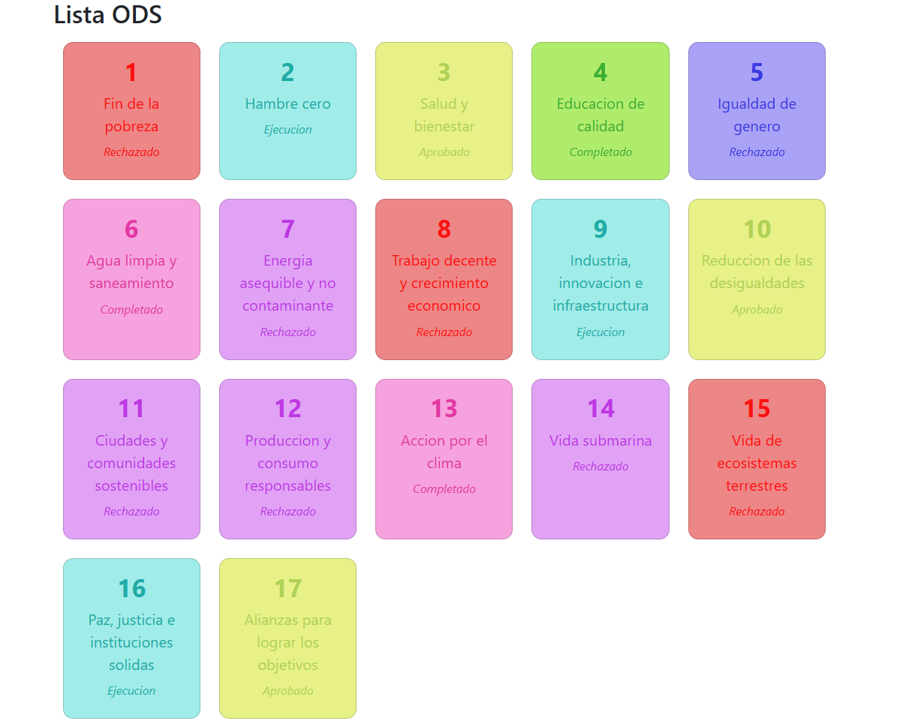

# Proyecto sostenible con React, Typescript y bootstrap

---
Proyecto en proceso
## Node.js
Node.js es un entorno que permite ejecutar JavaScript fuera del navegador. 
Normalmente se usa para crear aplicaciones en un servidor o para ejecutar herramientas de desarrollo del programa creado. 
En proyectos web actuales también se usa para instalar dependencias y ejecutar scripts mediante npm.

## Vite
Vite es una herramienta que facilita la creación y ejecución de proyectos web. 
La función principal de vite es iniciar un servidor de desarrollo rápido y compilar el código para que podamos ver los cambios en el navegador al momento. 
Se utiliza mucho en proyectos con frameworks modernos como React.

## React
React es una librería de JavaScript que se utiliza para crear interfaces de usuario. 
Permite dividir una página web en componentes los cuales se pueden reutilizar, lo que hace que el código sea mucho más fácil de mantener y de organizar. 
Aparte, React actualiza automáticamente la interfaz cuando se cambian los datos de la aplicación.

